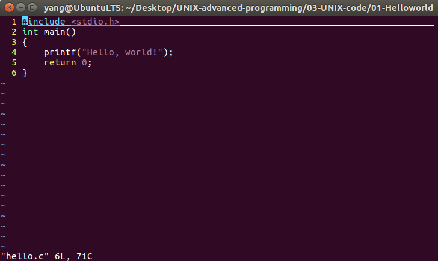
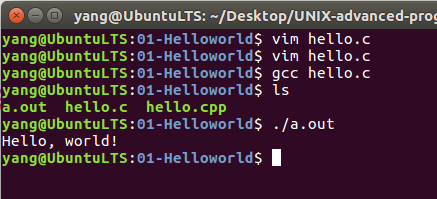
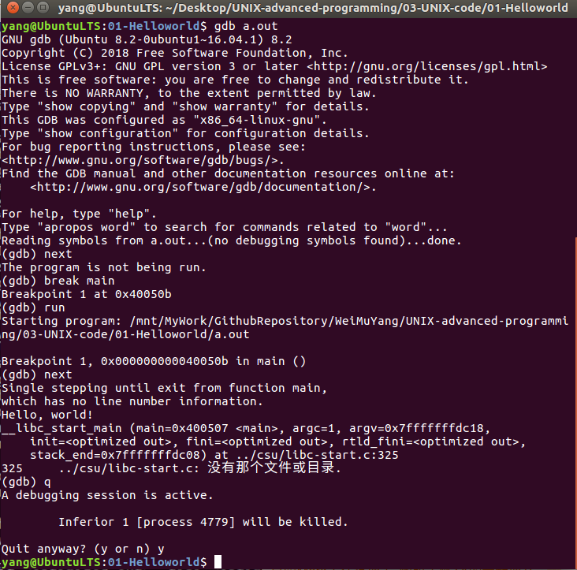

# Ubuntu开发环境的搭建   
## 1 安装环境  
- 在Ubuntu下搭建C/C++编程环境，综合起来说就是 vim+gcc+gdb。其中vim用于文本编辑，gcc用于程序编译，gdb用于代码调试。    
```shell
sudo apt-get install build-essential
sudo apt-get install gdb  
```

## 2 LINUX操作系统VIM的安装和配置  
- 配置vim   
```shell
sudo vim /etc/vim/vimrc 
```

- 添加配置文件内容   

```bash
set nu            // 在左侧行号
set tabstop=4     //tab 长度设置为 4
set nobackup      //覆盖文件时不备份
set cursorline    //突出显示当前行
set ruler         //在右下角显示光标位置的状态行
set autoindent    //自动缩进 
```

## 3 Ubuntu下程序编辑    
```shell
touch hello.c
vim hello.c
```

    

## 4 Ubuntu下程序编译与执行(gcc)    
```shell
gcc hello.c
./a.out   
```

    

## 5 Ubuntu下程序调试(gdb)    
```shell
gdb a.out   # 调试a.out
break main  # main函数位置设置断点
run			# 运行程序
next		# 下一行
quit		# 退出调试
```

    

## 6 常用命令   
### 6.1 常用编译命令选项  
1. 无选项编译链接   
	- 用法：#gcc test.c  
	- 作用：将test.c预处理、汇编、编译并链接形成可执行文件。这里未指定输出文件，默认输出为a.out。  
2. 选项 -o   
	- 用法：#gcc test.c -o test  
	- 作用：将test.c预处理、汇编、编译并链接形成可执行文件test。-o选项用来指定输出文件的文件名。  
3. 选项 -E  
	- 用法：#gcc -E test.c -o test.i  
	- 作用：将test.c预处理输出test.i文件。  
4. 选项 -S    
	- 用法：#gcc -S test.i  
	- 作用：将预处理输出文件test.i汇编成test.s文件。  
5. 选项 -c  
	- 用法：#gcc -c test.s  
	- 作用：将汇编输出文件test.s编译输出test.o文件。  
6. 无选项链接  
	- 用法：#gcc test.o -o test  
	- 作用：将编译输出文件test.o链接成最终可执行文件test。  
7. 选项-O  
	- 用法：#gcc -O1 test.c -o test  
	- 作用：使用编译优化级别1编译程序。级别为1~3，级别越大优化效果越好，但编译时间越长。  
### 6.2 多源文件的编译方法  
- 如果有多个源文件，基本上有两种编译方法：  
	- [假设有两个源文件为test.c和testfun.c]   
1. 多个文件一起编译   
	- 用法：#gcc testfun.c test.c -o test  
	- 作用：将testfun.c和test.c分别编译后链接成test可执行文件。  
2. 分别编译各个源文件，之后对编译后输出的目标文件链接。  
	- 用法：
```shell
#gcc -c testfun.c //将testfun.c编译成testfun.o
#gcc -c test.c 	  //将test.c编译成test.o
// 将testfun.o和test.o链接成test
#gcc -o testfun.o test.o -o test 
```
### 6.3 gdb调试器的使用   
- 输入命令:gdb Cfilename，开始调试程序。  
	- 下面列出一些gdb常用命令：

参数|作用
-|-
l |输出第n行到n+9行的源代码
break |在第n行设置断点
info break     |   查看断点信息
r          |          运行
n          |          单步执行
c          |          继续执行
p varName |     输出变量值
q           |         退出 


## 7 参考资料    
1. https://www.cnblogs.com/jfzhu/p/13467226.html   
2. https://blog.csdn.net/weixin_35477207/article/details/78165411   
3. https://blog.csdn.net/DaveBobo/article/details/76615188?utm_source=blogxgwz8   

