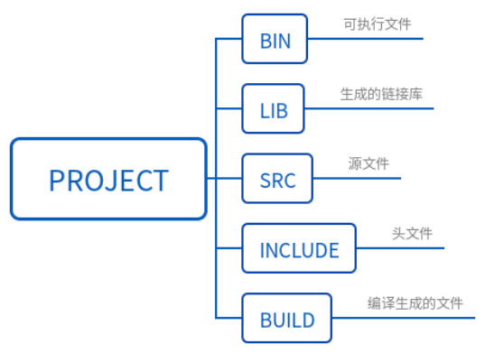
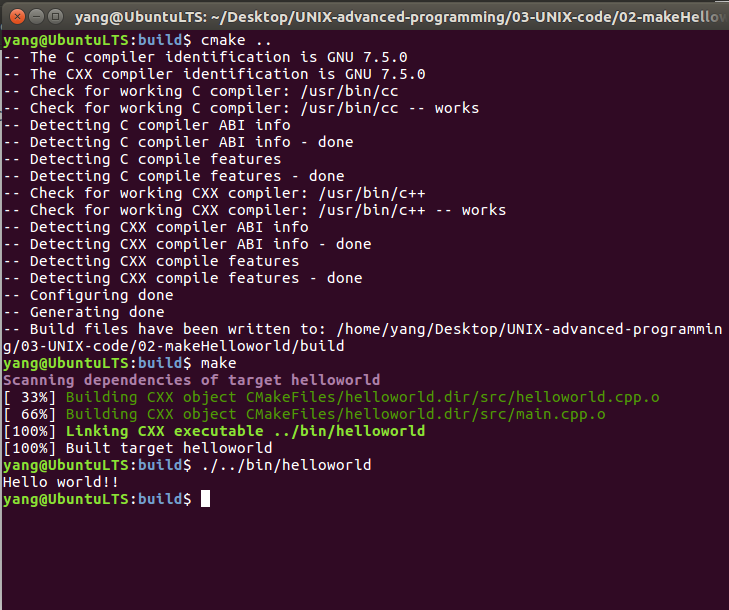

# Ubuntu下Cmake编译C++程序Helloworld   

## 1 Cmake的介绍    
- Cmake简介  
	- CMake是一个跨平台的编译自动配置工具，它使用一个名为CMakeLists.txt的文件来描述构建过程，可以产生标准的构建文件。   
	- 它可以用简单的语句来描述所有平台的安装(编译过程)。   
	- 它能够输出各种各样的makefile或者project文件，能测试编译器所支持的C++特性，类似UNIX下的automake。  
	- CMake并不直接建构出最终的软件，而是产生标准的建构档(如Unix的Makefile或Windows Visual C++的projects/workspaces)，然后再依一般的建构方式使用。    
- CMake的组态档   
	- CMake的组态档取名为CMakeLists.txt   
	- 组态档是用一种建构软件专用的特殊编程语言写的CMake脚本。  
	- 文件CMakeLists.txt需要手工编写，也可以通过编写脚本进行半自动的生成。   
	- 通过编写CMakeLists.txt，可以控制生成的Makefile，从而控制编译过程。   
- CMake的特点   
	1. 开放源代码，使用类BSD许可发布；   
	2. 跨平台，并可生成native编译配置文件，在Linux/Unix平台，生成makefile；在苹果平台，可以生成xcode；在windows平台，可以生成msvc的工程文件；   
	3. 能够管理大型项目；   
	4. 简化编译构建过程和编译过程，CMake的工具链非常简单：cmake+make；    
	5. 高效率；    
	6. 可扩展，可以为cmake编写特定功能的模块，扩充cmake功能。   

## 2 Cmake的使用   
```shell
# 查一下是否安装Cmake
cmake --version  
```
## 3 Cmake的用法      
### 3.1 创建目录和CMakeLists   

- 创建相关目录和文件    

```shell
mkdir 02-makeHelloworld
mkdir bin
mkdir lib
mkdir src
mkdir include
mkdir build
touch CMakeLists.txt
```

- 各个文件夹的作用    
     

### 3.2 创建项目文件    
- 创建源文件    

```shell
cd src
touch main.cpp
touch helloworld.cpp  
```

- 创建头文件   

```shell
cd ../include/
touch helloworld.h
```

### 3.3 编写makefilelist   
```shell
# 1. cmake最低版本以及工程名称
cmake_minimum_required(VERSION 2.8)
project(helloworld)

# 2. 设置编译方式（“debug”与“Release“）  
SET(CMAKE_BUILD_TYPE Release)  

# 3. 设置可执行文件与链接库保存的路径 
set(EXECUTABLE_OUTPUT_PATH ${PROJECT_SOURCE_DIR}/bin)
set(LIBRARY_OUTPUT_PATH ${PROJECT_SOURCE_DIR}/lib)

# 4. 设置头文件目录使得系统可以找到对应的头文件  
include_directories(
${PROJECT_SOURCE_DIR}/include
)

# 5. 选择需要编译的源文件，凡是要编译的源文件都需要列举出来
add_executable(helloworld src/helloworld.cpp src/main.cpp)
```

### 3.4 编译程序   
```shell
cd build
cmake ..
make
```

     


## 4 参考资料  

1. https://www.cnblogs.com/haijian/p/12039160.html  
2. https://blog.csdn.net/zhw864680355/article/details/80821761    