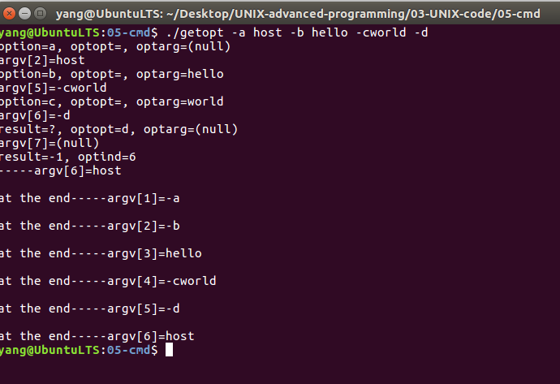

# 命令行选项及参数的实现    

## 1 进程与命令行参数   

- 一般来说，所有程序的代码都是从main函数开始执行，main函数的原型如下：  

```C++
int main(int argc,char *argv[],char *envp[]);
```

- main函数是可以带参数的，在程序中可以直接使用，这样使程序在不同的环境或者条件下选择性执行，同时，该函数也可以有返回值。    
- `argc`是命令行参数的数目（这个值包含命令本身，如果后面没有参数，则argc = 1）    
- `argv`是一个指针数组，其各个成员，依次指向各参数，即argv[0]指向命令本身，argv[1]指向第一参数，指针数组的最后一个成员是NULL ，以表示参数的结束    

## 2 命令行参数的识别    
- 平时使用命令行参数时，如果有多个参数的话，参数的顺序是随意的，不会让某个参数处于第一个或第二个位置，为了适用这种需求，Linux提供了函数getopt()和getlongopt()识别命令行参数。   

### 2.1 getopt函数的实现    
```c
// 1. etopt()获取命令行参数    
extern int getopt(int __argc, char *const *__argv,const char *optstring); 
```
> `__argc`：命令参数的个数    
> `__argv`：指向参数的数组   
> `optstring`：所有可能参数的字符串   

### 2.2 optstring的使用说明    
- `optstring`可以是下列参数：    

>  单个字符，这种表示选项    
>  单个字符后面接一个冒号`:`表示该选项后面必须接一个参数。参数紧跟在选项后或者以空格隔开      
>  单个字符后面接两个冒号`:`，表示该参数后面可以跟一个参数也可以不跟。参数必须紧跟在选项后，不能以空格隔开    

```shell
// 例如：optstring= "ab:c::d::"
./getopt -a -b host -chello -d word 
// host是b的参数，hello是c的参数。但是word不是d的参数，因为中间有空个隔开
```

### 2.3 getopt函数执行结果     
- getopt成功执行后将返回第一个选项，并设置如下全局变量：   
	- optarg：指向当前选项参数的指针     
	- optind：再次调用getopt()时的下一个argv指针的索引    
	- optopt：存储不可知或错误选项   
- 全局变量声明如下：   
```c
// 如果调用者为某个参数赋相应的值，则optarg指向该值   
// 例如：./test -a=10中，a为参数，赋值为10,则optarg指向10
extern char* optarg;
// 下一个参数在列表中的下标值   
extern int optind;
// opterr=0时，getopt不向stderr输出错误信息  
extern int opterr;
// 当命令行的选项字符，不包括在optstring中或者选项缺少必要参数时
// 该选项存储在optopt中，getopt返回？    
extern int  optopt;
```

### 2.4 getopt函数的应用示例   


```c
#include <stdio.h>
#include <stdlib.h>
#include <unistd.h>

int main(int argc, char **argv)
{
    int result;
    opterr = 0;
    while( (result = getopt(argc, argv, "ab:c::")) != -1 )
    {
           switch(result)
          {
               case 'a':
                   printf("option=a, optopt=%c, optarg=%s\n", optopt, optarg);
                   break;
              case 'b':
                   printf("option=b, optopt=%c, optarg=%s\n", optopt, optarg);
                   break;
              case 'c':
                   printf("option=c, optopt=%c, optarg=%s\n", optopt, optarg);
                   break;
              case '?':
                    printf("result=?, optopt=%c, optarg=%s\n", optopt, optarg);
                    break;
              default:
                   printf("default, result=%c\n",result);
                   break;
           }
        printf("argv[%d]=%s\n", optind, argv[optind]);
    }
    printf("result=-1, optind=%d\n", optind);

    for(result = optind; result < argc; result++)
         printf("-----argv[%d]=%s\n", result, argv[result]);
    for(result = 1; result < argc; result++)
         printf("\nat the end-----argv[%d]=%s\n", result, argv[result]);
    return 0;
}
```

## 3 运行效果    

    


