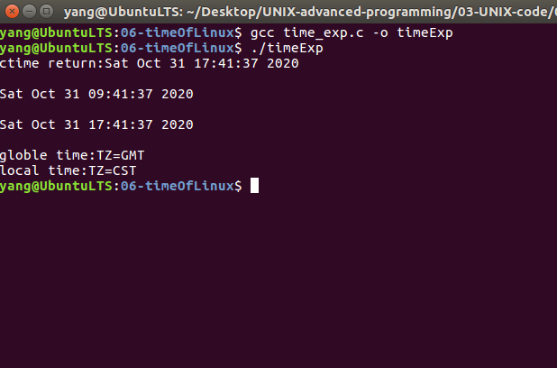

# Linux时间管理   
## 1 时间的介绍    

- Linux系统下，对时间管理首先要清楚UTC时间和Local Time时间的区别    
	- UTC：世界协调时，也就是GMT    
	- Local time为本地时间    
## 2 Linux下常用时间的接口API    
- 在编程中，经常需要读取当前时刻的系统时间、进程运行的时间等信息，这涉及到大量在`time.h`头文件中声明的函数    
- `clock()`函数，用来查看进程运行的时间、声明如下：

```c
extern clock_t clock(void);
```

- 此函数返回当前时刻程序运行的时间（user time + system time），其结果为始终计时器的值，将其转换成秒的公式为：   

```c
result / CLOCK_PER_SECOND
```

- `time()`用来获取当前系统的时间，函数声明如下：    

```c
extern time_t time(time_t *__timer)
// 其时间是自1970-1-1 0:0:0以来经历的秒数。
```

- `ctime()`将返回当前时间字符串  

```c
extern char *ctime(__const time_t *__timer)
// 时间格式：Day Mon dd hh:mm:ss yyyy
```

- `localtime()`将返回本地时间，其时间基准为当前设置的时区，该函数声明如下：

```c
extern struct tm *localtime(__const time_t *__timer)
struct tm{
	int tm_sec;		// [0,61]  闰秒
	int tm_min;		// [0,59]
	int tm_hour;	// [0,23]
	int tm_mday;	// [1,31]
	int tm_mon;		// [0,11]
	int tm_year;	// 起始自1900年
	int tm_wday;	// 起始自周日[0,6]
	int tm_yday;	// [0,365]
	int tm_isdst;	// 保存时间的标志，DST（夏令时） 
}
```

- 同时还可以通过调用`strftime`函数提取struct tm中的某一项    


## 3 时间接口的应用    

```c
#include<stdio.h>
#include<time.h>      // 时间的头文件  
#include<string.h>
int main() {
	time_t timep;
	time(&timep);
	printf("ctime return:%s\n",ctime(&timep));
	// ctime return:Sat Oct 31 17:41:37 2020 
	time_t timep1,timep2;
	time(&timep1);
	time(&timep2);
	printf("%s\n",asctime(gmtime(&timep1)));
	// Sat Oct 31 09:41:37 2020
    printf("%s\n",asctime(localtime(&timep2)));
	// Sat Oct 31 17:41:37 2020
	char buff[128];
	memset(buff,'\0',128);
	printf("globle time:");
	strftime(buff,128,"%Z",gmtime(&timep1));
	printf("TZ=%s\n",buff);// TZ=GMT
    
	
	printf("local time:");
	strftime(buff,128,"%Z",localtime(&timep2));
	printf("TZ=%s\n",buff); // TZ=CST
	return 0;
}

```

## 4 运行效果   

   


