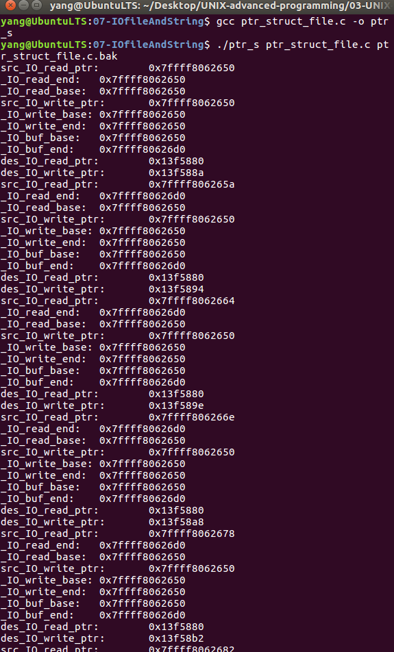

# 文件读写与文件流    

## 1 Linux与ANSI C标准    

- 本文介绍ANSI C库函数针对文件的管理操作。ANSI C标准被几乎所有的操作系统支持，Windows和Linux都遵循这一标准。    
- 在Windows系统使用ANSI C标准编写的程序可以不经修改的而直接在Linux平台下重新编译后运行，完全遵循这一标准的代码可移植性好。     
- 在Linux系统下，进行访问磁盘空间中的某个文件，每访问一次需要执行一次系统调用，执行系统调用将涉及CPU状态的切换，即从用户态切换到内核态，从用户空间切换到内核空间，频繁的磁盘访问对程序的执行效率将造成很大影响。   
- ANSI标准的C库中的文件处理函数为了减少使用系统调用的次数，提高效率，根据应用的不同，采用缓冲区机制，一次性从文件读大量的数据到缓冲区中，将修改的内容也存入缓冲区，减少CPU状态的切换次数，当缓冲区满或者需要更新时，通过系统调用将文件一次性写入到磁盘。     


## 2 文件流指针    
- 应用编程层面，程序对流的操作体现在文件流指针FILE上，在操作一个文件前，需要打开该文件，而使用ANSI C库函数fopen()打开一个文件之后，将返回一个文件流指针与文件关联，所有针对文件的操作都是通过该文件流指针完成。   

```C
// come frome /usr/include/stdio.h
typedef struct _IO_FILE FILE;   // 对FILE进行了重定义
// come frome /usr/include/libio.h
struct _IO_FILE{
	int _flags;
	char* _IO_read_ptr;		// 如果以读打开，当前读指针
	char* _IO_read_end;		// 如果以读打开，读区域结束位置
	char* _IO_read_base;	// 回放和读取区域的起始位置
	char* _IO_write_base;	// 如果以写打开，写区起始区
	char* _IO_write_ptr;	// 如果以写打开，当前写的指针
	char* _IO_write_end;	// 如果以写打开，写区域结束位置
	char* _IO_buf_base;		// 如果显式设置缓冲区，其起始位置
	char* _IO_buf_end;		// 如果显式设置缓冲区，其结束位置
	...
	int _ileno;				// 文件描述符
	...
};
```

## 3 应用示例     
```c
#include <stdlib.h>
#include <stdio.h>
#include <string.h>
// 1. 宏定义：定义打印的形式
#define prt(CONTENT,MSG) printf(CONTENT":\t%p\n",MSG)

int main(int argc, char *argv[])
{
	FILE *fp_src,*fp_des;
	char buffer[10],buffer1[128];
	int i;
	// 2. 以可读方式打开文件，文件名由argv传入
	if((fp_src=fopen(argv[1],"r+"))== NULL)	
	{
		perror("open1");
		exit(EXIT_FAILURE);
	}
	// 3. 以可写方式打开文件，文件名由argv传入
	if((fp_des=fopen(argv[2],"w+"))== NULL)
	{
		perror("open2");
		exit(EXIT_FAILURE);
	}
	// 4. 显示缓冲区的位置和类型，在一般应用中不需要，这里为了演示示例
	setvbuf(fp_src,buffer1,_IOLBF,128);
	do
	{
		prt("src_IO_read_ptr",fp_src->_IO_read_ptr); // 源文件读位置  0x7ffff8062650   0x7ffff806265a    
 		prt("_IO_read_end",fp_src->_IO_read_end);	// 0x7ffff8062650   0x7ffff80626d0 
 		prt("_IO_read_base",fp_src->_IO_read_base); // x7ffff8062650  0x7ffff8062650
	
 		prt("src_IO_write_ptr",fp_src->_IO_write_ptr);	// 源文件写位置0x7ffff8062650   0x7ffff8062650
 		prt("_IO_write_base",fp_src->_IO_write_base);// 0x7ffff8062650 0x7ffff8062650
 		prt("_IO_write_end",fp-src->_IO_write_end);// 0x7ffff8062650 0x7ffff8062650
	
		prt("_IO_buf_base",fp_src->_IO_buf_base);	// 源文件缓冲区位置0x7ffff8062650 0x7ffff8062650
		prt("_IO_buf_end",fp_src->_IO_buf_end);// 0x7ffff8062650 0x7ffff80626d0 
		
		memset(buffer,'\0',10);  // 申请10个字节的缓冲区，初始化为 `\0`
		i = fread(buffer,1,10,fp_src);	// 读 10个字节
		fwrite(buffer,1,i,fp_des);		// 写 10个字节
		
 		prt("des_IO_read_ptr",fp_des->_IO_read_ptr);	// 目标文件读位置0x13f5880 0x13f5880
		prt("des_IO_write_ptr",fp_des->_IO_write_ptr);	// 目标文件写位置0x13f588a 0x13f5894 
	}while(i==10);    // 若读取字符个数不能是10个的话，代表读取结束  
	fclose(fp_src);
	fclose(fp_des);
}
```

## 4 运行效果   

   