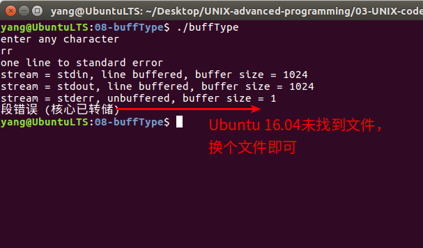

# 缓冲区的类型及其应用   

## 1 缓冲区的类型    
标准I/O提供了3种类型的缓冲区：全缓冲区、行缓冲区和无缓冲区。  
1. 全缓冲区：这种缓冲区默认大小是BUFSIZ，具体的大小和系统定义有关。在缓冲区满或者调用刷新函数fflush()后才进行I/O系统调用操作。   
```c
// come from /usr/include/stdio.h
#ifndef BUFSIZ				// BUFSIZ全局宏定义
#define BUFSIZ _IO_BUFSIZ
#endif
// come from /usr/include/libio.h
#define _IO_BUFSIZ _G_BUFSIZ
// come from /usr/include/_g_config.h
#define _G_BUFSIZ 8192      // 真是大小依据不同系统而定
```

2. 行缓冲区：当遇到换行符或者缓冲区满时，行缓冲区才刷新，大小依据系统有所差异，部分系统默认行缓冲区的大小为128字节。终端即行缓冲区。    
3. 不带缓冲区：标准I/O库不对字符进行缓冲。如果要用标准I/O函数写若干字符到不带缓冲区的流中，则相当于用write()系统调用函数将这些字符写至相关联的打开文件。标准的出错流stderr是不带缓冲区的，这使得出错信息能尽快的显示出来。  

对于标准的输入和输出设备，ANSI C要求具有以下缓冲区特征：   
- 标准输入和标准输出设备：当且仅当不涉及交互作用设备时，标准输入流和标准输出流才是全缓冲区的。   
- 标准错误输出设备：标准出错决不会是全缓冲区。     


## 2 缓冲区的应用示例   

```c
#include <stdio.h>
// 函数声明
void pr_stdio(const char *, FILE *);
int main(void)
{
        FILE* fp;
        fputs("enter any character\n", stdout);
        if(getchar()==EOF) // 如果获取的是文件的结尾符号
                printf("getchar error");
        fputs("one line to standard error\n", stderr); // 输出
        pr_stdio("stdin",  stdin);	// 标准输入：行缓冲区
        pr_stdio("stdout", stdout);	// 标准输出：行缓冲区
        pr_stdio("stderr", stderr);	// 输出错误信息：无缓冲区

        if ( (fp = fopen("/etc/motd", "r")) == NULL)
                printf("fopen error");
        if (fgetc(fp) == EOF)
                printf("getc error");
        pr_stdio("/etc/motd", fp);		// 文件读写：普通文件全缓冲区（16.04没找到文件）
        return(0);
}
// 
void pr_stdio(const char *name, FILE *fp)
{
        printf("stream = %s, ", name);// 要存的字符串
        if (fp->_flags & _IO_UNBUFFERED)
			printf("unbuffered");   // 无缓冲区
        else if (fp->_flags & _IO_LINE_BUF) 
			printf("line buffered");// 行缓冲区
        else
			printf("fully buffered");// 全缓冲区
        printf(", buffer size = %ld\n", fp->_IO_buf_end-fp->_IO_buf_base);
}
```

## 4 运行效果   
     


## 5 缓冲区的修改   
对于任意流，系统将默认指定其流缓冲区的类型，如果用户期望自己指定缓冲区的位置，可以调用setbuf()和setvbuf()函数更改缓冲区类型，从而可以便捷的访问缓冲区的内容。   
1. setbuf()声明如下：   
```c
// come from /usr/include/stdio.h
// if BUF is NULL,make STREAM unbuffered.Else make it use buffer BUF,of size BUFSIZ.
extern void setbuf(FILE* _restrict _stream,char* _restrict _buf);
// _stream:要操作的流对象
// _buf：必须指向一个长度为BUFSIZ的缓冲区。若_buf设置为NULL，则关闭缓冲区。
```

2. setvbuf()函数声明如下：   

```c
// Make STREAM use buffering mode MODE.If BUF is not NULL,use N bytes of it for buffering; else allocate an internal buffer N bytes long   
extern int setvbuf(FILE* _restrict _stream,char* _restrict _buf,int _modes,size_t _n);
// _stream:要操作的流对象
// _buf:指向一个长度为第4个参数指示大小的缓冲区，
// _modes：缓冲区的类型，取值如下：
#define _IOFBF 0   	// 全缓冲区
#define _IOLBF 1	// 行缓冲区
#define _IONBF 2	// 无缓冲区
```

## 6 缓冲区修改的应用   

```c
/* Example show usage of setbuf() &setvbuf() */
#include<stdio.h>
#include<error.h>
#include<string.h>
int main( int argc , char ** argv )
{
	int i;
	FILE * fp;
	char msg1[]="hello,wolrd\n";
	char msg2[] = "hello\nworld";
	char buf[128];

//open a file and set nobuf(used setbuf).and write string to it,check it before close of flush the stream
	if(( fp = fopen("no_buf1.txt","w")) == NULL)// 打开文件
	{
		perror("file open failure!");
		return(-1);
	}
	setbuf(fp,NULL); 			// fp指向的缓冲区关闭	 
	memset(buf,'\0',128);		// 申请128字节的区域给buf，并初始化为0
	fwrite( msg1 , 7 , 1 , fp );// 将msg1的7个字符写入文件no_buf1.txt
	printf("test setbuf(no buf)!check no_buf1.txt\n");
	printf("now buf data is :buf=%s\n",buf);//查看缓冲区内容

	printf("press enter to continue!\n");
	getchar();
	fclose(fp);


//open a file and set nobuf(used setvbuf).and write string to it,check it before close of flush the stream
	if(( fp = fopen("no_buf2.txt","w")) == NULL)
	{
		perror("file open failure!");
		return(-1);
	}
	setvbuf( fp , NULL, _IONBF , 0 );// 设置无缓冲区
	memset(buf,'\0',128);		
	fwrite( msg1 , 7 , 1 , fp );	 // 将msg1的7个字符写入文件no_buf2.txt
	printf("test setvbuf(no buf)!check no_buf2.txt\n");

	printf("now buf data is :buf=%s\n",buf);//查看缓冲区的内容

	printf("press enter to continue!\n");
	getchar();
	fclose(fp);

//open a file and set line buf(used setvbuf).and write string(include '\n') to it,
//
//check it before close of flush the stream
	if(( fp = fopen("l_buf.txt","w")) == NULL)
	{
		perror("file open failure!");
		return(-1);
	}
	setvbuf( fp , buf , _IOLBF , sizeof(buf) );// 设置行缓冲区
	memset(buf,'\0',128);
	fwrite( msg2 , sizeof(msg2) , 1 , fp );// 将msg2的第一行写入l_buf.txt
	printf("test setvbuf(line buf)!check l_buf.txt, because line buf ,only data before enter send to file\n");

	printf("now buf data is :buf=%s\n",buf); // 打印缓冲区的值
	printf("press enter to continue!\n");
	getchar();
	fclose(fp);  // 调用了fclose()函数，在结束后会自动刷新缓冲区，写入了第二行

//open a file and set full buf(used setvbuf).and write string to it for 20th time (it is large than the buf)
//check it before close of flush the stream
	if(( fp = fopen("f_buf.txt","w")) == NULL){
		perror("file open failure!");
		return(-1);
	}
	setvbuf( fp , buf , _IOFBF , sizeof(buf) ); // 设置全缓冲区
	memset(buf,'\0',128);
	fwrite( msg2 , sizeof(msg2) , 1 , fp );    // 没写入任何信息
	printf("test setbuf(full buf)!check f_buf.txt\n");
	
	printf("now buf data is :buf=%s\n",buf);// 打印缓冲区的值
	printf("press enter to continue!\n");
	getchar();

	fclose(fp);// 调用了fclose()函数，在结束后会自动刷新缓冲区，所有第一行和第二行写入
}
```


