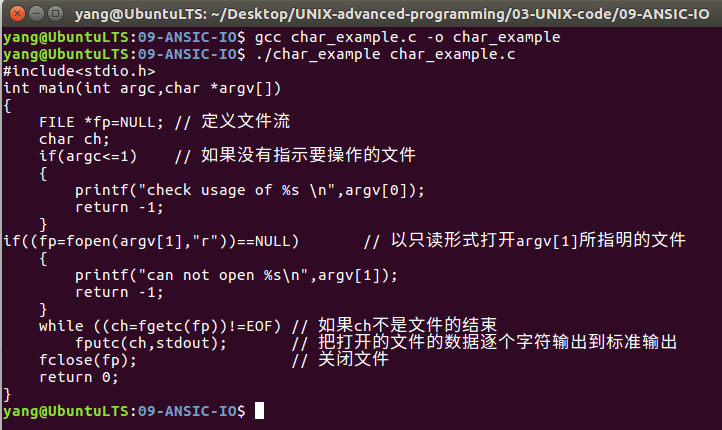
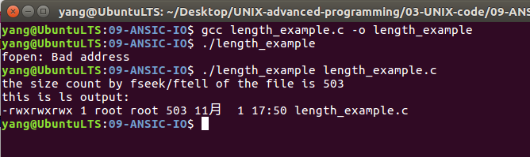

# ANSI C文件I/O操作和格式化I/O流    
## 1 文件的打开和关闭   
### 1.1 打开文件   
在对文件操作之前需要和流联系到一起。函数fopen()完成这一操作，声明如下：    
```c
// come from /usr/include/stdio.h
// 打开一个文件，为它创建一个流
extern FILE* fopen(_const char* _restrict _filename,_const char* _restrict _modes);
// filename:打开一个文件名的字符串指针，可以使用绝对路径，也可以是相对路径   
// modes：打开模式，r(只读)，r+(可读)，w(只写),w+(可读写),a(只写追加),a+(可读写追加);对于涉及到写的模式，若没有文件则创建，对于涉及到读的没有文件的话，返回错误。
```
- 注意：modes：里面的a也可能是ab，使得标准I/O系统可以区分文本文件和二进制文件，但是要求操作系统内核支持这一功能（Windows下要求区分普通文件和二进制文件，但是Unix系统下将两者没有区别）        

### 1.2 关闭文件   
在完成对流对象的操作后，需要关闭该流对象，关闭某个流对象操作是使用fclose函数。该函数在关闭某个流对象之前，**将缓冲区中的相关内容回写到相应的文件中（这一操作由系统完成）**，如果程序没有调用fclose()函数，但正常退出，回写操作依然正确执行。   
```c
// come from /usr/include/stdio.h
extern int fclose(FILE* _stream);
```

### 1.3 更新缓冲区内容    
即使缓冲区没有填满，也可以刷新缓冲区的内容，是需要通过I/O 系统调用fflush()函数，其声明如下：   
```c
// come from /usr/include/stdio.h 
// 刷新缓冲区，如果缓冲区为NULL，刷新所有流
extern int fflush(FILE* _stream);
```

## 2 读写文件流    
根据应应用的不同需要，ANSI标准提供了3种类型I/O处理函数。也就是字符读写、行读写和块读写。   
如果使用了缓冲区，则不需要每次进行标准I/O处理时都使用系统I/O调用。    

### 2.1 字符读写文件流    
1. 字符读操作，是指每次标准I/O调用只读出流中的一个字符。   
```c
// come from /usr/include/stdio.h 
// 从流中读取字符
extern int fgetc(FILE* _stream);
extern int getc(FILE* _stream);
```

- 如果期望从标准输入流读入一个字符，可以使用getchar() ,相当于fgetc(stdin)声明如下：   
```c
// come from /usr/include/stdio.h 
// 从stdin中读取一个字符
extern int getchar(void);  
```

2. 字符写操作   
字符写操作是指每次标准I/O调用只写一个字符到流中。相关函数如下     
```c
// come from /usr/include/stdio.h 
// 在流中写入字符
extern int fputc(int _c,FILE* _stream);  // 将字符c写入stream中
extern int putc(int _c,FILE* _stream);
```

- 试图向标准输出流写一个字符，可以使用putchar() ,相当于fputc(c, stdout)声明如下：   
```c
// come from /usr/include/stdio.h 
// 从stdin中读取一个字符
extern int putchar(int _c);  	// 写字符c到标准输出设备
```

### 2.2 应用示例   
```c
#include<stdio.h>
int main(int argc,char *argv[])
{
    FILE *fp=NULL; // 定义文件流
    char ch;
    if(argc<=1)    // 如果没有指示要操作的文件
    {
        printf("check usage of %s \n",argv[0]);
        return -1;
    }
if((fp=fopen(argv[1],"r"))==NULL)	// 以只读形式打开argv[1]所指明的文件
    {
        printf("can not open %s\n",argv[1]);
        return -1;
    }
    while ((ch=fgetc(fp))!=EOF)	// 如果ch不是文件的结束
        fputc(ch,stdout);	// 把打开的文件的数据逐个字符输出到标准输出
    fclose(fp);				// 关闭文件
    return 0;
}
```

    

### 2.3 行读写文件流    
1. 行读出操作：行读出操作是指每次标准I/O调用只从标准流中读取一行（没有达到行限制）字符。fgets函数如下：   

```c
// come from /usr/include/stdio.h 
// 获取一个新行字符流，也是流的有限一部分   
extern char* fgets(char* _restrict _s, int _n,FILE* _restrict)
```

- 该函数从将字符中stream读入s所指的内存单元，直到读取n-1字符、换行符或者遇到文件结束标志EOF为止，并将最后一个空间置为\\0 。     
- 成功完成后，fgets()返回s，如果流位于文件末尾，则设置此流的文件结束指示器，并返回一个空指针。   
- 如果出现读取错误，则设置流的错误指示符，返回一个空指针。    


2. 行写入操作 ：行写入操作是指每次标准I/O调用只写一行字符到标准流中。函数声明如下：   
```c
// come from /usr/include/stdio.h 
// 向流写一个串
extern int fputs(_const char* _restrict _s,FILE* _restrict _stream);
// 写一个新的串，输出到标准输出流
extern int puts(_const char*_s);
```

- puts()将s指向的以空字符结尾的字符串（后接换行赋）写入标准输出流stdout。fputs将s指向的以空字符结尾的字符串写入指定输出stream，但不追加换行符。
- **由于这两个函数都不能写入终止的空字符**。基于这一特点，**这两个函数不能用来操作二进制文件**，因为二进制文件包含\\0的可能性很大。  

###  2.4 应用示例   
```c
#include<stdio.h>
int main(int argc,char *argv[])
{
    FILE *fp=NULL;
    char str[10];                       // 10个字节
    if((fp=fopen(argv[1],"r"))==NULL) 	//以只读形式打开文件aa.txt
    {
        printf("can not open!\n");
        return -1;
    }
    fgets(str,sizeof(str),fp);		//从打开的文件中读取sizeof(str)个字节到str
    fputs(str,stdout);			//将str中的内容逐行输出到标准输出
    fclose(fp);					//关闭已打开的文件
    return 0;
}
```

   

### 2.5 块读写文件流   
块读写文件流是指每次读出与写入的数据量可以由编程人员设定。    
1. 块读出操作   
```c
// come from /usr/include/stdio.h 
// 读取流中的数据块
extern size_t fread(void *_restrict _ptr,size_t _size,size_t _n,FILE* _reatrict _stream);
// 此函数将从第4个参数所指示的流中读取n个大小为size的对象存放于第一个参数ptr所指向的内存空间。
// 第一个参数为读取对象的存放位置;
// 第二个参数为读取对象的大小;
// 第三个参数为读取对象的个数;
// 第四个参数为读取的流。
```

- 此函数返回实际读取到的对象个数（不是读写的字节大小），如果此值比参数n小，则代表可能读到了文件的尾部，这时必须用feof()或者ferror()来检测发生了什么。   

2. 块写入操作   

```c
// come from /usr/include/stdio.h 
// 将数据块写入到流   
extern size_t fwrite(_const void *_restrict _ptr,size_t _size,size_t _n,FILE* _restrict _s);
// 此函数将4个参数s所指的流中写入n个大小为size的对象存储于ptr所指示的空间中。   
// 第一个参数为指向欲写入的对象的数据空间指针，即写入的对象存放位置
// 第二个参数为写入对象的大小  
// 第三个参数为写入的个数
// 第四个参数为写入的字符流
```

### 2.6 应用示例   
```c
#include<stdio.h>
int main(int argc,char *argv[])
{
    struct student
    {
        char name[10];
        int number;
    };
    FILE *fp=NULL;
    int i;
    struct student boya[2],boyb[2],*pp,*qq;
    if((fp=fopen("aa.txt","w+"))==NULL) //以可读写的方式打开文件；若该文件存在则清空，若不存在就创建
    {  //打开文件失败
        printf("can not open!\n");
        return -1;
    }
    pp=boya;
    qq=boyb;
    printf("please input two students‘ name and number:\n");
    for (i=0;i<2;i++,pp++) 
    	scanf("%s\%d",pp->name,&pp->number);// 输入两个学生信息
    pp=boya;
    fwrite(pp,sizeof(struct student),2,fp); //将从键盘输入的信息写入到文件流fp中,注意文件是二进制，文本打开是乱码的
    rewind(fp); //将读写位置定位到文件头（重点）
    fread(qq,sizeof(struct student),2,fp); //从文件流fp中读两个结构体到qq
    printf("name\t\t number\n");
    for(i=0;i<2;i++,qq++) //输出qq中的内容
        printf("%s\t\t %d\n",qq->name,qq->number);
    fclose(fp);
    return 0;
}
```

### 2.7 文件流的检验   
如果fread读到了文件的尾部或者出错，将使用feof函数检测。ANSI 提供了如下的检测函数：     
```c
extern int feof(FILE* _stream);  	// 如果读到-1,则肯定读到了结束
extern int ferror(FILE* _stream);  	// 如果没有出错，返回0
extern int clearerr(FILE* _stream); // 执行错误处理后，清除错误标识位
```

### 2.8 文件流的定位   
在对文件流进行操作时，有一个指针指向流的当前读写位置，如果希望从特殊位置读写，则通过函数修改当前读写的位置      
```C
// 返回当前读写位置:返回当前读写位置距离文件开始的字节数，失败的话，返回-1   
extern long int ftell(FILE* _stream);
// 修改当前读写位置：成功返回0,失败返回1
extern int fseek(FILE* _stream, long int _off,int _whence);
// 第一个参数为操作流的对象，第二个参数是针对第三个参数的偏移量，第三个参数是修改位置的基准，基准一共由3个：
#define SEEK_SET 0 // 文件的开始位置 
#define SEEK_CUR 1 // 当前位置
#define SEEK_END 2 // 文件结束位置

// 重置当前读写位置为文件的开始位置
extern void rewind(FILE* _stream);
```

### 2.9 应用示例    
```c
#include <stdio.h>
#include <stdlib.h>

int main(int argc,char *argv[])
{
	int n=0;
	FILE *fp;
	if((fp=fopen(argv[1],"r"))==NULL) 
	{
		perror("fopen");
		exit(EXIT_FAILURE);
	}
	if(fseek(fp,0,SEEK_END)!=0)		// 设置当前读取的位置是文件尾
	{
		perror("fseek");
		exit(EXIT_FAILURE);
	}

	if((n=ftell(fp))==-1)			// 求得当前文件读写的位置值：距离开始的字节数
	{
		perror("ftell");
		exit(EXIT_FAILURE);
	}
	printf("the size count by fseek/ftell of the file is %d\n",n);
	printf("this is ls output:\n");
	execl("/bin/ls","ls","-l",argv[1],(char *)0);// 通过ls命令求得的文件信息
	fclose(fp);
}
```

    


