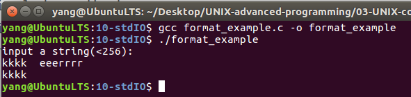

# 流的格式化输入和输出    
因为数据在磁盘存储格式和人最易识别的格式不尽相同，格式化的输入和输出函数主要实现数据按照指定的格式输入和输出。    
## 1 printf/scanf函数   
printf()将输出按指定格式放置在标准输出流stdout上。    
```c
int printf(const char*,...)
```
scanf()可以从标准的输入流stdin中按指定的格式读取数据     
```c
int scanf(const char*,...)
```

## 2 fprintf/fscanf函数  
### 2.1 函数说明    
printf/scanf函数针对的是标准的输入和输出流，而 fprintf/fscanf函数可用于任意流，当然也包括标准的输入和输出流    

```c
int fprintf(FLIE* ,const char*,...)
int fscanf(FLIE* ,const char*,...)
```
### 2.2 基本应用    
从某个流输出   
```c
char buf[] = "test";
FILE* fp;
fp = fopen("test","w");   // 打开文件，建立fp流
fprintf(stdout,"%s",buf); // 按照%s的方式输出到标准输出设备
fprintf(fp,"%s",buf);	  // 输出到文件test
```

向某个流输入   
```c
char c;
FILE* fp;
fp = fopen("test","r");  // 打开文件，建立fp流
fscanf(stdin,"%c",&c);   // 从标准输出设备，以%c格式读字符c
fscanf(fp,"%c",&c);	     // 从文件test中读字符c
```

### 2.3 应用示例   
```c
#include<stdio.h>
#include<stdlib.h>
int main(int argc,char *argv[])
{
	char a_buf[256],b_buf[256];
	FILE *fp;
	if((fp=fopen("./tmp","w+"))==NULL) // 以写的方式建立文件
	{
		perror("fopen");
		exit(EXIT_FAILURE);
	}
	printf("input a string(<256):\n");
	scanf("%s",a_buf);		// 输入字符串
	fprintf(fp,"%s",a_buf);	// 将字符串写入文件流
	rewind(fp);				// 指针指向文件的开始
	fscanf(fp,"%s",b_buf);	// 从文件流写字符串
	printf("%s\n",b_buf);	// 打印从文件流写的字符串
	fclose(fp);				
	return 0;
}
```

    


## 3 sprintf/sscanf函数    
fprintf/fscanf函数可用于任意流，而sprintf/sscanf函数则主要是针对字符串的操作，函数声明如下：

### 3.1 sprintf函数    
```c
int sprintf(char* buffer, const char* format[, argument]...);
// sprintf是将列出的数据或者变量（第3个及后面多个参数）以format格式输出到以buffer为起始位置的内存空间中。
```

```c
// 1. 可以将整数转换成字符串
sprintf(s,"%d",123);   // 代替itoa函数
// 2. 可以控制浮点数的打印格式
sprintf(s,"%f",3.1415923);   // 产生"3.1415923"字符串
sprintf(s,"%10.3f",3.1415923);// 产生"3.142"字符串
// 3. 连接字符串
char* who = "I";  
char* whom = "English";  
sprintf(s,"%s love %s",who, whom);
```


### 3.2 sscanf函数   
sscanf函数和scanf函数类似，都是用于输入的，指示后者以标准输入设置stdin为输入源，前者是以固定字符为输入源而已。    

```c
int scanf(const char* format[,argument]...);
extern sscanf(_const char* _restrict _s,_const char* _restrict _format,...);
// sscanf可以从字符串中取出整数、浮点数和字符串等 

// 1. 提取字符串
char str[512] = {0};
sscanf("123456", "%s", str);
printf("str=%s",str);
// 2. 取指定长度的字符串
sscanf("123456", "%4s", str);
// 3. 取到指定字符为止的字符串
sscanf("123456 abcdef", "%[^ ]", str); // 取遇到空格为止的字符串
// 4. 取仅包含指定字符集的字符串
sscanf("123456abcdefBCDEF", "%[1-9a-z]", str); // 取仅包含1-9和a-z的字符
// 5. 取到指定字符集为止的字符串
sscanf("123456abcdefBCDEF", "%[^A-Z]", str); //  取遇到大写字母就停止的字符串
```

### 3.3 应用示例   

获取CPU的频率   

```c
#include <stdio.h> 
#include <string.h> 
float get_cpu_clock_speed () 
{ 
      FILE* fp; 
      char buffer[1024]; 
      size_t bytes_read; 
      char* match; 
      float clock_speed; 
       
      fp = fopen ("/proc/cpuinfo", "r"); 
      bytes_read = fread (buffer, 1, sizeof (buffer), fp); 
      fclose (fp); 
      if (bytes_read == 0 || bytes_read == sizeof (buffer)) 
      	return 0; 
      buffer[bytes_read] = '\0'; 
      match = strstr (buffer, "cpu MHz");			//匹配 
      if (match == NULL) 
      	return 0; 
      sscanf (match, "cpu MHz : %f", &clock_speed);	//读取 
      return clock_speed; 
} 
int main (void) 
{ 
      printf ("CPU clock speed: %4.0f MHz\n", get_cpu_clock_speed ()); 
      return 0; 
}
```


