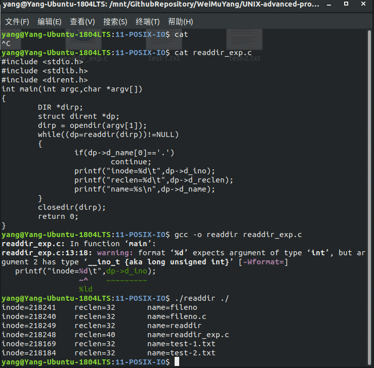

# POSIX标准下的IO     

[toc]

Linux操作系统中，实现了两类对文件IO的管理，一类是遵循POSIX的标准，Linux操作系统自身提供IO系统调用，如：open、close等。但是可移植性比较差，只能在遵循POSIX标准的类UNIX环境直接使用。   
另一类是由ANSI标准提供的标准的IO函数，这些是对直接IO 系统调用的封装。    

## 1 文件描述与文件流    
ANSI C库函数是用户态实现，流的相应资源也存在于用户空间，但无论如何实现最终都是需要通过内核实现对文件的读写控制。   
Linux内核中，如何打开一个文件的？Linux内核源文件/uer/src/kernel/'uname -r'/include/linux/fs.h中定义的struct file结构是用来保存打开文件基本信息的    
```C
// come from /uer/src/kernel/'uname -r'/include/linux/fs.h
struct file{
	struct list_head	f_list;			// file链表 
	struct dentry 		*f_dentry;		// 文件的denty结构
	struct vfsmount		*f_vfsmnt;		// 文件系统挂载位置
	struct file_operations *f_op;	// 文件操作，open，read，write等代码位置
	atomic_t 			f_count;		// 使用此结构进程数
	unsigned int 		f_flags;		// 文件标志
	mode_t 				f_mode;			// 文件的打开模式
	int 				f_error;
	loff_t				f_pos;			// 文件操作指针的当前位置
	unsigned int    	f_uid, f_gid;	// 文件的uid和gid
}
```

对于用户空间来说，任何打开的文件都将被分配一个唯一非负数，用于标识该打开文件，该值即文件描述符      
因此，任意进程在运行时，默认打开的3个流对象（标准输入设备stdin、标准输出设备stdout和标准错误输出设备stderr）都有对应的文件描述符，其文件描述符分别为0、1、2。    
```c
// come from /uer/include/unistd.h
// 标准文件描述   
#define STDIN_FILENO  0     // 标准输入设备 
#define STDOUT_FILENO 1		// 标准输出设备
#define STDERR_FILENO 2		// 标准错误输出设备  
```

由以上可知，ANSI C库IO 函数其实是对Posix IO函数的封装，在其基础上加上了流的概念，并在用户空间申请了流资源（FILE)，这样处理显然增加了程序的灵活性和可移植性     

## 2 文件表结构   
 Linux为管理每个进程打开的文件，在进程的私有结构体struct task_struct中，对任何进程来说，都会专门分配管理打开文件的信息的表项，用以指示当前进程打开文件的结构体struct file，而在struct file中，将最终指向对应的文件。    

 ## 3 文件描述符与文件流的转换操作   
Linux为用户层提供了函数`fileno()` 以从文件流中读取其文件的描述符相接。函数声明如下：    
```shell
extern FILE *fdopen(int _fd, _const char* _modes)   
```
此函数第1个参数为一个文件描述符，第2个参数为封装该流的权限，如果执行成功，将返回一个流对象。如果返回一个流对象。如果失败，将返回NULL。   
```c++
#include <stdio.h>
#include <unistd.h>
#include <stdlib.h>
#include <fcntl.h>
#include <sys/types.h>
#include <sys/stat.h>

int main(int argc, int *argv[]){
	int fp1,fp2;
	printf("stdin is:\t%d\n",fileno(stdin));    // 标准输入设备
	printf("stdout is:\t%d\n",fileno(stdout));	// 标准输出设备 
	printf("stderr is:\t%d\n",fileno(stderr));	// 标准错误输出设备
	if((fp1=open("/mnt/GithubRepository/WeiMuYang/UNIX-advanced-programming/03-UNIX-code/11-POSIX-IO/test-1.txt",O_WRONLY))==-1)  // 打开文件
	{
		perror("open");
		exit(EXIT_FAILURE);
	}
	if((fp2=open("/mnt/GithubRepository/WeiMuYang/UNIX-advanced-programming/03-UNIX-code/11-POSIX-IO/test-2.txt",O_WRONLY))==-1)  // 打开文件
    {
        perror("open");
        exit(EXIT_FAILURE);
    }
	printf("test-1 file is: \t%d\n",fp1);	// 打印文件描述符
	printf("test-2 file is: \t%d\n",fp2);	// 打印文件描述符
	close(fp1);
	close(fp2);
	return 0;
}
```


输出如下结果：   
```shell
stdin is:	0
stdout is:	1
stderr is:	2
test-1 file is: 	3
test-2 file is: 	4
```

## 4 创建、打开和关闭文件   
### 4.1 创建    
```c
extern int open(_const char* _file, int _oflag, ...)
// 第1个参数：预打开文件的路径
// 第2个参数：参数打开文件的方式，相关参数略   
// 第3个参数：如果打开文件不存在，使用open函数自动创建文件，第3个参数需要约定文件的权限
```

### 4.2 关闭    
```c
extern int close(int _fd);
// 第1个参数：调用open函数打开文件时返回的文件描述符。也就是fp       
```

### 4.3 创建    
```c
extern int creat(_const char* _file, _mode_t _mode)
// 第1个参数：创建文件的路径
// 第2个参数和umask值一起决定该文件的权限
```


## 5 文件控制fcntl   
1. 函数说明   
	- 函数fcntl()函数用于修改某个文件描述符的特殊属性。     

```C
extern int fcntl(int _fd, int _cmd , ...);
// 第1个参数是为欲修改属性的文件描述符。
// 第2个参数是相应的操作    
```

## 6 其他操作     
1. 文件读写：read和write   
2. 文件定位：lseek   

## 7 同步   
### 7.1 同步内核缓冲区   
UNIX和Linux系统在设计时，使用了内核缓冲区，大多数磁盘I/O都通过，缓存进行，当数据写到文件上时，通常该数据复制到缓冲区中，如果缓存尚未写满，则不降其排入队列，而是等待其写满或者当内核需要刷新缓冲区时，再将该缓存写入输出队列，然后待其到达队首时，才进行相应的I/O操作。这种输出方式被称为延迟写。   
为了保证磁盘上实际文件系统与缓存中内容的一致性，sync、fsync和fdatasync系统调用可以更新缓冲区，sync函数声明：    
```c
void sync(void);
// 这和个函数始终成功，但sync只是将所有修改过的块缓存排入写队列，然后返回，它并不代表实际的I/O操作结束。系统每隔一段时间，调用一次sync函数，这样保证定期刷新内核的块缓存。
```

这个缓冲区和第4章介绍的标准C的缓冲区是不一样的，标准C设置的缓冲区在用户空间。而当下结束的缓冲区时内核空间。    
延迟写减少可读取磁盘的次数，但是降低了文件内容的更新速度，使得欲写到文件中的数据在一段时间内并没有写到磁盘。当系统发生故障，可能造成文件更新的内容丢失。     

### 7.2 映射文件到内存     
函数mmap将某个文件的指定内容映射到内存空间中，从而提供了不同于一般的普通文件访问，进程可以像读取内存一样对文件进行访问，不必再调用read和write等操作。    


## 8 锁定和解锁文件    
在多任务的系统环境中，如果两个进程并发对同一个文件进行写操作，可能会导致文件遭到破坏。因此为了避免这种问题的发生，必须要采用某种机制解决多个进程并发访问同一个文件时所面临的同步问题。    
函数flock()和fcntl() 都可以提供文件的锁操作，但是flock()函数只能锁定整个文件，不能锁定到某个区域，而fcntl函数可以提供任意文件位置的锁定。    

## 9 目录流的基本操作    
在Linux下，“一切都是文件”，因此，目录也是文件，指示存储的内容不同于普通的文件，目录文件中存储的该目录下所有的文件及子目录文件信息，主要是各文件名与其存储位置的inode节点之间的对应关系。   
在应用层来看，目录也可以类似于文件读写内容。      

### 9.1 打开和关闭目录文件  
1. opendir()和closedir()用于打开和关闭目录文件   
### 9.2 读写目录内容   
- readdir读取目录内容     

     

### 9.3 定位目录位置   
1. telldir：返回目录流关联的当前位置    
2. seekdir：类似于fseek   
3. readdir：将引用目录流的位置重置到目录的开头   

### 9.3 添加和删除目录    
1. mkdir：创建目录    
2. rmdir：删除目录    

### 9.4 当前工作路径   
#### 9.4.1 获取当前路径   
1. getcwd    
2. get_current_dir_name 等      

#### 9.4.2 修改当前工作目录   
1. chdir：修改进程工作目录   


### 9.5 总结   
内核为当前进程与进程打开文件建立联系，在进程的PCB中使用一个成员来指向关于打开文件列表的结构体，struct files_struct，而结构体中struct file\*fd_array[]是一个指针数组，指向每个打开文件的信息结构体。    
内核将这个数组中每个成员的下标值，传递给用户空间用来标识该打开的文件，该值是文件描述符值    


